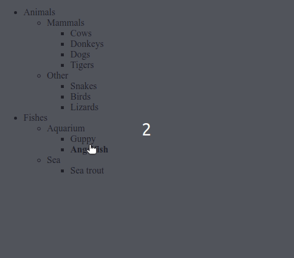

# Baum-Menü

- Füge JavaScript hinzu, das
  - Das Ein- und Ausblenden der verschachtelten Listen beim Anklicken aktiviert, wie in der Animation gezeigt
  - Aktiviere den fettgedruckten Text, wenn du mit der Maus darüber fährst, wie in der Animation gezeigt

**Voraussetzungen**

- Bearbeite die HTML-Datei nicht
- Füge nur einen Event-Handler hinzu (verwende Delegation)
- Ein Klick außerhalb des Listen-Textes (auf ein leeres Feld) sollte nichts bewirken
- Wenn du den Mauszeiger außerhalb des Listen-Textes (auf einer leeren Fläche) bewegst, sollte das nichts bewirken.

**Anmerkungen**

- Tipp: Sieh dir das HTML und CSS in index.html genau an und denke daran, dass JavaScript _alles_ auf der Seite ändern kann
- Es gibt mehrere Lösungen
- Es kann sein, dass du eine Technik anwenden musst, die im Unterricht nicht behandelt wurde - Techniken zu erforschen und zu finden ist eine wichtige Fähigkeit für Entwickler!
